# Session Visibility Logic — Complete Analysis

> **Generated:** 2026-02-03  
> **Scope:** CrewHub frontend — how sessions flow from SSE to the Active view and Parking Lane

---

## Table of Contents

1. [High-Level Overview](#1-high-level-overview)
2. [Data Flow: SSE → Render (Sequence Diagram)](#2-data-flow-sse--render)
3. [Session Visibility Decision Tree (Flowchart)](#3-session-visibility-decision-tree)
4. [Room Assignment Logic (Flowchart)](#4-room-assignment-logic)
5. [Agent Registry & Session Ownership](#5-agent-registry--session-ownership)
6. [Detailed Decision Point Explanations](#6-detailed-decision-point-explanations)
7. [Issues, Edge Cases & Inconsistencies](#7-issues-edge-cases--inconsistencies)
8. [Suggestions for Improvement](#8-suggestions-for-improvement)

---

## 1. High-Level Overview

The visibility pipeline has **5 stages**:

```
SSE Events → Session State → Active/Parking Split → Agent Ownership Split → Room Assignment → Render
```

A session is either:
- **Active** (shown in a Room on the playground) — max 15
- **Parked** (shown in the Parking Lane sidebar)
- **Hidden** (an agent's main session or child session claimed by an agent — rendered as part of the agent card, not independently)

---

## 2. Data Flow: SSE → Render


### SSE Fallback Mechanism


---

## 3. Session Visibility Decision Tree

This is the **complete decision tree** that determines where a session ends up:

```mermaid
flowchart TD
    START([Session arrives from SSE]) --> CHECK_PARKING

    subgraph PARKING["shouldBeInParkingLane(session, isActivelyRunning)"]
        CHECK_PARKING[Evaluate session] --> GET_STATUS["getSessionStatus(session)"]
        GET_STATUS --> STATUS_SLEEP{"updatedAt > 30min ago?<br/>(status === 'sleeping')"}
        STATUS_SLEEP -->|Yes| PARK_YES([🅿️ PARKING LANE])
        STATUS_SLEEP -->|No| CHECK_RUNNING{"isActivelyRunning?<br/>(token change < 30s ago)"}
        CHECK_RUNNING -->|Yes| PARK_NO([✅ ACTIVE])
        CHECK_RUNNING -->|No| CHECK_IDLE{"idleSeconds > 30?"}
        CHECK_IDLE -->|Yes| PARK_YES
        CHECK_IDLE -->|No| PARK_NO
    end

    PARK_NO --> SORT_ACTIVE["Sort active sessions by updatedAt DESC"]
    SORT_ACTIVE --> SLICE_15["Take first 15: visibleSessions"]
    SLICE_15 --> BEYOND_15{"Session index ≥ 15?"}
    BEYOND_15 -->|Yes| HIDDEN_ENTIRELY([🚫 NOT RENDERED AT ALL])
    BEYOND_15 -->|No| AGENT_CHECK

    subgraph OWNERSHIP["Agent Ownership Check"]
        AGENT_CHECK["Check against agentRuntimes"] --> IS_AGENT_MAIN{"session.key in<br/>agentSessionKeys?"}
        IS_AGENT_MAIN -->|Yes| AGENT_CLAIMED([🤖 Part of Agent Card])
        IS_AGENT_MAIN -->|No| IS_AGENT_CHILD{"session.key in any<br/>runtime.childSessions?"}
        IS_AGENT_CHILD -->|Yes| AGENT_CLAIMED
        IS_AGENT_CHILD -->|No| ORPHAN([🔵 ORPHAN SESSION])
    end

    ORPHAN --> ROOM_ASSIGN["Assign to Room<br/>(see Room Assignment flowchart)"]
    ROOM_ASSIGN --> RENDER_IN_ROOM([🏠 Rendered in Room])

    PARK_YES --> SORT_PARKING["Sort parking sessions by updatedAt DESC"]
    SORT_PARKING --> RENDER_PARKING([💤 Rendered in Parking Lane])

    style PARK_YES fill:#f5d0fe,stroke:#a855f7
    style PARK_NO fill:#bbf7d0,stroke:#22c55e
    style HIDDEN_ENTIRELY fill:#fecaca,stroke:#ef4444
    style AGENT_CLAIMED fill:#bfdbfe,stroke:#3b82f6
    style ORPHAN fill:#ddd6fe,stroke:#8b5cf6
    style RENDER_IN_ROOM fill:#bbf7d0,stroke:#22c55e
    style RENDER_PARKING fill:#f5d0fe,stroke:#a855f7
```



### getSessionStatus() Thresholds

| Time since update | Status |
|---|---|
| < 5 min | `active` |
| 5–30 min | `idle` |
| > 30 min | `sleeping` |

### shouldBeInParkingLane() Truth Table

| getSessionStatus | isActivelyRunning (tokens changed < 30s) | idleSeconds > 30 | Result |
|---|---|---|---|
| `sleeping` | any | any | **PARKING** |
| `active` or `idle` | `true` | any | **ACTIVE** |
| `active` or `idle` | `false` | `true` | **PARKING** |
| `active` or `idle` | `false` | `false` | **ACTIVE** |

**Key insight:** A session that was updated 45 seconds ago (status=`active`) but has NOT had a token change in the last 30 seconds will be **parked** (because `idleSeconds > 30` and `isActivelyRunning` is false). This is the most surprising behavior.

---

## 4. Room Assignment Logic

This only applies to **orphan sessions** (sessions not claimed by any agent):


### Rule Types (from API)

| Rule Type | What it checks | Example |
|---|---|---|
| `session_key_contains` | `sessionKey.includes(value)` | `:cron:` → automation-room |
| `keyword` | `label.toLowerCase().includes(value)` | `deploy` → ops-room |
| `model` | `model.toLowerCase().includes(value)` | `opus` → dev-room |
| `label_pattern` | Regex test on label + sessionKey | `^agent:.*:main$` |
| `session_type` | Predefined type checks | `cron`, `subagent`, `main`, `slack`, etc |

Rules are evaluated by priority (descending). First match wins.

---

## 5. Agent Registry & Session Ownership


### How Child Sessions are Matched

Two criteria (OR):
1. **Label contains parent reference:** `session.label?.includes('parent=' + agent.agent_session_key)`
2. **Key prefix:** `session.key.startsWith(agent.agent_session_key + ':')`

**Example:** Agent with `agent_session_key = "agent:dev:main"` would claim:
- Session with label `"crewhub-fix parent=agent:dev:main"`
- Session with key `"agent:dev:main:subagent:abc123"`

---

## 6. Detailed Decision Point Explanations

### 6.1 `shouldBeInParkingLane(session, isActivelyRunning)`

**Location:** `minionUtils.ts`

This is the primary gate. It determines if a session shows in the active playground or the parking lane sidebar.

**Logic flow:**
1. Calculate `idleSeconds` = `(now - session.updatedAt) / 1000`
2. Get `status` via `getSessionStatus()`:
   - `sleeping` if > 30 min idle
   - `idle` if 5–30 min idle
   - `active` if < 5 min idle
3. If `sleeping` → **always park** (regardless of other factors)
4. If `isActivelyRunning` is true → **never park** (this overrides idle time)
5. Otherwise, if `idleSeconds > 30` → **park**

### 6.2 `isActivelyRunning(sessionKey)`

**Location:** `PlaygroundView.tsx`

This tracks whether a session's `totalTokens` value has changed within the last 30 seconds. It uses a `Map<string, { previousTokens, lastChangeTime }>` ref that updates on every render cycle when sessions change.

**Why this exists:** A session might have `updatedAt` from 2 minutes ago (status = `active`) but if its token count is still changing, it's clearly doing work. This prevents sessions from flickering to parking while they're mid-generation.

**Limitation:** Only tracks `totalTokens`. If a session is doing work that doesn't increment tokens (e.g., waiting for a tool response), it won't be detected as "actively running."

### 6.3 The 15-Session Limit

**Location:** `PlaygroundView.tsx` — `visibleSessions = sortedActiveSessions.slice(0, 15)`

**Why:** This is a **UI performance and density cap**. The playground uses a 4-column CSS grid. With a reasonable number of rooms (4-8), having more than 15 active orphan sessions would overcrowd the view. Sessions beyond position 15 are simply not rendered anywhere — they're not in parking either.

**Problem:** This is a silent drop. Sessions 16+ that pass the active filter are invisible with no indication to the user.

### 6.4 Orphan vs Agent-Claimed Sessions

**In PlaygroundView:**
```
agentSessionKeys = Set of all agent.agent_session_key values
```

For each `visibleSession`:
- If `session.key` is in `agentSessionKeys` → it's an agent's main session → **claimed** (rendered as part of the agent card)
- If `session.key` matches any `runtime.childSessions[].key` → **claimed** (rendered as child under agent)
- Otherwise → **orphan** (rendered independently in a room)

### 6.5 Room Assignment (for orphans)

Priority cascade:
1. **Explicit API assignment** (`/api/session-room-assignments`)
2. **API rules** (`/api/room-assignment-rules`) — evaluated by priority, first match wins
3. **Static defaults** (`roomsConfig.ts → getDefaultRoomForSession()`)
4. **First room** (`rooms[0].id`)

If the target room doesn't exist in the map, falls back to `rooms[0]`.

### 6.6 `getSessionStatus()`

Pure time-based check:
- `< 5 min` → `active`
- `5-30 min` → `idle`
- `> 30 min` → `sleeping`

Used in `shouldBeInParkingLane()` and in `getStatusIndicator()` for UI badges.

---

## 7. Issues, Edge Cases & Inconsistencies

### 🔴 Critical

#### 7.1 Silent Session Drop at Position 15+
**Issue:** `visibleSessions.slice(0, 15)` silently drops sessions. Active sessions at index 15+ are not shown in the playground OR the parking lane. They're invisible.

**Impact:** During bursts (e.g., spawning many subagents), users won't see all active sessions.

**Suggested fix:** Either increase the limit dynamically, add an overflow indicator ("+ N more"), or route overflow sessions to parking.

#### 7.2 30-Second Idle Threshold is Very Aggressive
**Issue:** Any session that hasn't had a token change in 30s AND was updated more than 30s ago gets parked. Many normal operations (waiting for user input, long tool calls, API rate limits) can easily exceed 30s.

**Impact:** Sessions flicker in and out of parking during normal operation. A session waiting for a file upload or an HTTP response will get parked.

### 🟡 Medium

#### 7.3 Token Tracking Only Tracks `totalTokens`
**Issue:** `isActivelyRunning` only checks if `session.totalTokens` has changed. Sessions doing tool work (file reads, shell commands) that don't generate new tokens appear idle.

**Impact:** A session actively running a shell command that takes >30s will be parked.

#### 7.4 Dual Room Config Systems (Legacy + API)
**Issue:** There are two room routing systems:
- **Legacy:** `roomsConfig.ts` with `localStorage` + `autoAssignRoom()` (keyword matching)
- **API:** `useRooms()` with server-side rules

The `ParkingLane.tsx` still uses the legacy `getRoomForSession()` from `roomsConfig.ts` for display, while `PlaygroundView.tsx` uses the API-based `useRooms().getRoomForSession()`. This can cause inconsistencies.

#### 7.5 Agent Child Session Matching is Fragile
**Issue:** Child session matching uses two heuristics:
- `s.label?.includes('parent=' + agent.agent_session_key)` — requires the label to contain an exact string
- `s.key.startsWith(agent.agent_session_key + ':')` — requires key prefix matching

If the label format changes or a subagent's key doesn't follow the prefix convention, it won't be claimed and will show as an orphan.

#### 7.6 Double `useSessionsStream` Instance
**Issue:** `useAgentsRegistry` internally calls `useSessionsStream(enableStream)`. `PlaygroundView` receives `sessions` as a prop (from a parent that also calls `useSessionsStream`). This means there are **two independent SSE connections** to the same endpoint, potentially causing:
- Double network traffic
- State inconsistencies between the two streams
- Race conditions where agents see different sessions than the playground

### 🟢 Minor

#### 7.7 `getSessionStatus` vs `shouldBeInParkingLane` Overlap
**Issue:** `getSessionStatus` returns `idle` for 5-30 min, but `shouldBeInParkingLane` parks anything idle > 30 seconds. The `idle` status from `getSessionStatus` is almost never relevant for parking decisions — it's only used for UI indicators.

#### 7.8 Parking Lane Has No Limit
**Issue:** While active sessions are capped at 15, parking sessions have no cap. With many stale sessions, the parking lane could grow very long.

#### 7.9 Opacity Fade in Parking Lane
**Issue:** `getIdleOpacity` returns 0 at 300s (5 min). Sessions idle >5 min become invisible in the parking lane (opacity: 0) but are still rendered and taking space.

---

## 8. Suggestions for Improvement

### 8.1 Fix the Silent 15-Session Drop
```typescript
// Option A: Show overflow indicator
const overflowCount = sortedActiveSessions.length - 15
// Render: "+ {overflowCount} more active sessions"

// Option B: Route overflow to parking
const visibleSessions = sortedActiveSessions.slice(0, 15)
const overflowSessions = sortedActiveSessions.slice(15)
const allParkingSessions = [...parkingSessions, ...overflowSessions]
```

### 8.2 Smarter Activity Detection
Instead of only tracking `totalTokens`, also track:
- `session.messages.length` (new messages = activity)
- `session.updatedAt` changes (any update = activity)
- Last message content type (tool_use blocks = running)

```typescript
const isActivelyRunning = useCallback((session: MinionSession): boolean => {
  const tracked = tokenTrackingRef.current.get(session.key)
  if (!tracked) return false
  const tokenChanged = Date.now() - tracked.lastChangeTime < 30000
  const recentlyUpdated = Date.now() - session.updatedAt < 15000
  const lastMsg = session.messages?.[session.messages.length - 1]
  const hasActiveToolCall = lastMsg?.content?.some(b => b.type === 'tool_use' || b.type === 'toolCall')
  return tokenChanged || recentlyUpdated || !!hasActiveToolCall
}, [])
```

### 8.3 Deduplicate SSE Connections
Share the session stream between `useAgentsRegistry` and `PlaygroundView` via React Context or by passing sessions as a prop to `useAgentsRegistry`:

```typescript
// Instead of useAgentsRegistry calling useSessionsStream internally:
export function useAgentsRegistry(sessions: CrewSession[]) {
  // Use the sessions passed in, no separate SSE connection
}
```

### 8.4 Increase Idle Threshold or Make It Configurable
30 seconds is too aggressive for many workflows. Consider:
- Default: 60-120 seconds
- User-configurable in settings
- Different thresholds per session type (subagents can park faster than main agents)

### 8.5 Remove Legacy Room Config
Migrate fully to the API-based room system. The dual system creates confusion and potential bugs. Update `ParkingLane.tsx` to use `useRooms()` instead of `loadRoomsConfig()`.

### 8.6 Add Session Status from Backend
Instead of inferring status client-side from `updatedAt` and token counts, have the backend send explicit status:
- `running` (actively processing)
- `waiting` (waiting for user/tool response)
- `idle` (no pending work)
- `completed` (session finished)

This would eliminate all the guesswork in `shouldBeInParkingLane` and `isActivelyRunning`.

---

## Appendix: Complete State Machine

```mermaid
stateDiagram-v2
    [*] --> SSE_Received: session-created / session-updated

    SSE_Received --> Sleeping: updatedAt > 30min ago
    SSE_Received --> TokensChanging: totalTokens changed < 30s ago
    SSE_Received --> RecentlyActive: updatedAt < 30s ago, no token change
    SSE_Received --> Idle30s: updatedAt 30s-30min ago, no token change

    Sleeping --> ParkingLane
    TokensChanging --> ActiveFilter
    RecentlyActive --> ActiveFilter
    Idle30s --> ParkingLane

    ActiveFilter --> Top15: sorted position < 15
    ActiveFilter --> Dropped: sorted position ≥ 15

    Top15 --> AgentClaimed: key matches agent session
    Top15 --> AgentChildClaimed: key in agent childSessions
    Top15 --> OrphanSession: not claimed by any agent

    AgentClaimed --> AgentCard: rendered inside agent
    AgentChildClaimed --> AgentCard
    OrphanSession --> RoomAssignment

    RoomAssignment --> ExplicitRoom: has API assignment
    RoomAssignment --> RuleRoom: matches API rule
    RoomAssignment --> StaticDefault: matches static config
    RoomAssignment --> FirstRoom: no match, use rooms[0]

    ExplicitRoom --> RenderedInRoom
    RuleRoom --> RenderedInRoom
    StaticDefault --> RenderedInRoom
    FirstRoom --> RenderedInRoom

    ParkingLane --> RenderedInParkingLane
    Dropped --> NotRendered

    note right of Dropped: ⚠️ Silent drop - no UI indication
    note right of Idle30s: ⚠️ 30s is very aggressive
```


