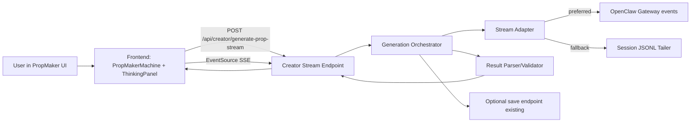
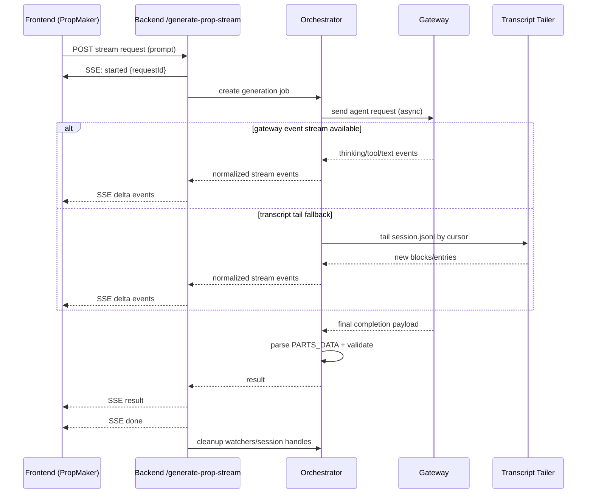

# PropMaker True Streaming Architecture

## Goal
Replace fake client-side thinking simulation with **real, low-latency, progressive AI generation streaming** for Creator Zone PropMaker.

This design keeps existing `/api/creator/generate-prop` behavior intact while adding a dedicated streaming path.

---

## Executive Summary

**Recommended architecture:**
- Frontend transport: **SSE** (`EventSource`) from backend to browser
- Backend orchestration: spawn an **isolated per-request generation session**
- Upstream source (adapter pattern):
  1. **Primary**: gateway-native agent events (if available for thinking/tool chunks)
  2. **Fallback**: incremental tail of OpenClaw session JSONL transcript
- Completion: parse final response into `parts/code`, emit `result`, then `done`

This gives:
- low-latency token/thinking updates
- clean separation from existing chat WebSocket flow
- future-proofing if gateway streaming improves

---

## Current State (as of codebase)

- `PropMakerMachine.tsx` currently calls `POST /api/creator/generate-prop` and waits for one final response.
- `ThinkingPanel` displays timer-based fake logs (`THINKING_STAGES`) not connected to real model activity.
- `backend/app/routes/creator.py` uses `conn.send_chat(...)` (request/response, non-streaming) and returns final payload.
- Existing backend has generic SSE infrastructure (`backend/app/routes/sse.py`) but no Creator-specific stream lifecycle.

---

## Key Findings (for design decisions)

### 1) Does OpenClaw gateway support native streaming for agent sessions?
From current integration code:
- Gateway is used via WebSocket RPC (`method: "agent"`) and waits for final result.
- `OpenClawConnection.call()` currently resolves request/response and optional "final result", but no direct public streamed chunks API in this layer.
- Event subscription exists generically (`subscribe(event_name, handler)`), but creator flow does not consume token-level events today.

**Conclusion:** treat gateway-native streaming as **capability-detected optional path**, not guaranteed.

### 2) Poll transcript or use gateway events?
- Use **gateway events when available** (lowest latency, cleanest semantics).
- Otherwise use **incremental file tail** on session JSONL (already readable in current architecture).
- Never full polling loops over complete history; use offset/cursor tailing.

### 3) Session lifecycle
Use isolated generation session per request:
1. Create session/job context
2. Start stream immediately (SSE `started` event)
3. Dispatch agent request asynchronously
4. Stream deltas from adapter (event-based or transcript tail)
5. Parse/validate result
6. Emit `result` + `done`
7. Cleanup watchers/session resources

### 4) Thinking blocks raw vs formatted?
- Keep raw canonical payload in backend event (`raw`) for debugging
- Send normalized UI-friendly fields (`message`, `kind`, `toolName`, etc.)
- Frontend renders friendly timeline with optional "raw" expandable dev view

---

## Architecture

## Component Diagram



---

## Sequence Diagram



---

## API Specification

## Endpoint

`POST /api/creator/generate-prop-stream`

Content-Type: `application/json`

Request:
```json
{
  "prompt": "A glowing mushroom lamp",
  "use_ai": true,
  "mode": "stream",
  "debug": false
}
```

Response:
- `200 OK`
- `Content-Type: text/event-stream`
- stream of named SSE events

## SSE Events

### `started`
```json
{
  "requestId": "req_abc123",
  "jobId": "gen_01",
  "sessionKey": "agent:dev:...",
  "ts": 1739270000000
}
```

### `thinking`
Normalized reasoning/thought step (if available)
```json
{
  "requestId": "req_abc123",
  "seq": 12,
  "kind": "thinking",
  "message": "Designing multi-part geometry",
  "raw": {"type":"reasoning","...":"..."},
  "ts": 1739270001200
}
```

### `tool_call`
```json
{
  "requestId": "req_abc123",
  "seq": 15,
  "kind": "tool_call",
  "toolName": "read",
  "status": "started",
  "inputPreview": "docs/features/...",
  "raw": {"...":"..."},
  "ts": 1739270001800
}
```

### `tool_result`
```json
{
  "requestId": "req_abc123",
  "seq": 16,
  "kind": "tool_result",
  "toolName": "read",
  "status": "ok",
  "outputPreview": "...",
  "raw": {"...":"..."},
  "ts": 1739270002200
}
```

### `text_delta`
```json
{
  "requestId": "req_abc123",
  "seq": 20,
  "kind": "text_delta",
  "delta": "export function",
  "accumulatedChars": 342,
  "ts": 1739270002800
}
```

### `progress`
(optional coarse milestone)
```json
{
  "requestId": "req_abc123",
  "phase": "parsing_output",
  "percent": 85,
  "ts": 1739270003500
}
```

### `result`
Final generated payload (same schema as existing endpoint)
```json
{
  "requestId": "req_abc123",
  "name": "GlowingMushroomLamp",
  "filename": "GlowingMushroomLamp.tsx",
  "code": "import ...",
  "parts": [{"type":"cylinder","position":[0,0.2,0],"args":[...],"color":"#...","emissive":false}],
  "method": "ai"
}
```

### `error`
```json
{
  "requestId": "req_abc123",
  "code": "GEN_TIMEOUT",
  "message": "Generation timed out after 120s",
  "recoverable": true,
  "ts": 1739270010000
}
```

### `done`
```json
{
  "requestId": "req_abc123",
  "ok": true,
  "durationMs": 18432,
  "ts": 1739270010500
}
```

---

## Backend Design

## New modules (proposed)

- `backend/app/routes/creator_stream.py`
  - SSE endpoint and request validation
- `backend/app/services/creator_stream/orchestrator.py`
  - lifecycle, cancellation, timeout, completion logic
- `backend/app/services/creator_stream/adapter.py`
  - capability detection + unified event mapping
- `backend/app/services/creator_stream/transcript_tailer.py`
  - incremental JSONL cursor tail
- `backend/app/services/creator_stream/event_mapper.py`
  - raw event -> normalized SSE event schema

## Orchestration rules

- Start SSE quickly (<100ms target) with `started`
- Run generator in background task
- Push stream updates through bounded async queue
- Guarantee terminal event ordering: `result|error` then `done`
- Ensure cleanup on:
  - client disconnect
  - timeout
  - backend exception

## Capability detection

At runtime per request:
1. If gateway emits recognized chunk/thinking/tool events for this request/session: use event mode
2. Otherwise switch to transcript tail mode within same request (no client reconnect)

---

## Frontend Design

## PropMaker flow changes

In `PropMakerMachine.tsx`:
- Replace `fetch('/api/creator/generate-prop')` with streaming call:
  - `fetch` to initiate + read SSE stream (or EventSource-compatible POST wrapper)
- Feed incoming events into new thinking timeline state
- Update preview progressively:
  - show status immediately
  - optionally show partial code text in debug panel
  - on `result` set `previewParts`, `previewName`, etc.

## ThinkingPanel changes

- Remove timer-based `THINKING_STAGES` simulation
- Render live events grouped by type:
  - thinking
  - tool calls/results
  - text deltas
- Preserve latest N entries (e.g., 200)
- optional “Developer details” collapsible raw payload view

---

## Error Handling Strategy

## Error classes

- `GATEWAY_UNAVAILABLE` (503)
- `GEN_TIMEOUT` (408 semantic, stream error event then done)
- `CLIENT_DISCONNECTED` (silent cleanup)
- `INVALID_MODEL_OUTPUT` (AI output unparsable; fallback template optional)
- `TAILER_IO_ERROR` (transcript read issue)

## Behavior

- Stream errors as SSE `error` event (structured, recoverable flag)
- Backend should still close stream with `done`
- Optionally fall back to template generation and emit `result.method = "template"`

---

## Performance Considerations

- Use per-client bounded queue (drop/coalesce low-priority deltas when backpressured)
- Coalesce `text_delta` at ~30–50ms cadence to reduce event flood
- Keep-alive ping/comment every 15–30s
- Avoid re-reading full transcript: maintain file offset cursor
- Cap stream session lifetime (e.g., 2 minutes default)
- Disable proxy buffering (`X-Accel-Buffering: no` already used in SSE infra)

---

## Security & Privacy

- Treat reasoning/tool stream as sensitive debug data
- Do not expose full tool inputs/outputs by default in production UI
- Redact secrets from streamed raw payloads
- Request-scoped IDs must be unguessable

---

## Backward Compatibility & Rollout

## Phase 1 (safe intro)
- Add new stream endpoint only
- Keep existing `/generate-prop` unchanged
- Feature flag frontend: `CREATOR_PROP_STREAMING=true`

## Phase 2
- Default to streaming endpoint
- Keep old endpoint as fallback for older clients

## Phase 3
- Optional deprecation of fake thinking simulation and old non-streaming path

---

## Acceptance Criteria

1. Thinking panel shows real model-derived events (not timers)
2. First stream event appears quickly after user submit (<500ms target local)
3. Preview/result appears without waiting for artificial completion animation
4. Existing non-streaming endpoint still works
5. Connection drops/timeouts handled gracefully with user-visible message

---

## Direct answers to option comparison

- **Option 1 SSE:** best frontend transport choice ✅
- **Option 2 WebSocket:** unnecessary for one-way logs right now; higher complexity
- **Option 3 Gateway-native stream:** use when available, but as optional upstream source
- **Option 4 Hybrid polling:** only as fallback via efficient transcript tail cursor (not coarse polling)

**Final recommendation:**
Use **SSE to frontend + adapter-based upstream (gateway events first, transcript tail fallback)** with isolated generation lifecycle.
